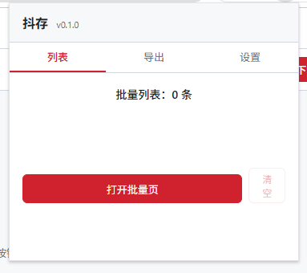
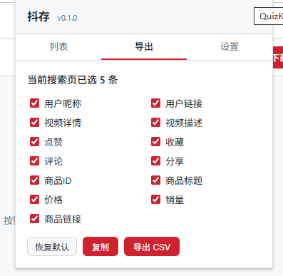
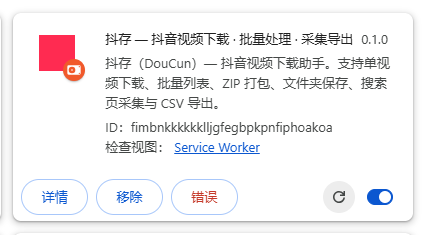

# 抖存 DouCun

> ⚠️ 本扩展只做「下载与采集」，不提供任何绕过登录、付费或权限控制的能力；请仅用于个人学习、研究与合法备份，并遵守平台服务条款与著作权法。

> 实测环境：Chrome 153 / Manifest V3（Windows）；抖音网页版需处于登录状态。

抖音网页版的视频下载、批量打包与搜索页数据采集工具：在你已登录的真实浏览器里完成全部操作，数据只在本机流转，不经过任何自建服务器，不需要账号，不构造接口签名。

## 功能特性

- 📥 **单视频下载**：首页推荐流 / 视频详情页 / 搜索页 / 博主主页四类页面自动注入下载按钮，按最高码率解析直链，带实时进度
- 📦 **批量打包**：卡片「+」加入批量下载列表 → 批量页多选 → 打包 ZIP（流式写盘）或保存到指定文件夹
- 📊 **搜索页采集导出**：搜索结果逐条勾选 → 13 个字段结构化 → 导出 CSV / 复制到剪贴板，字段可自由配置
- 🎵 **原声 / 活动采集**：粘贴「XX创作的原声」链接、活动（趋势）链接或 `v.douyin.com` 分享短链，自动解析出该原声或活动下的全部作品，一键汇入批量列表 —— 也可直接导出 CSV
- 🔒 **复用页面真实请求**：解析走页面自身的登录态，请求参数严格白名单，不逆向、不伪造签名，风控暴露面最小
- 🩺 **自带诊断**：`<html data-dyx-diag>` 实时暴露捕获数、来源路径、缓存条目、注入数量、错误码，出问题不必翻控制台
- 🧩 **纯本地**：无后端、无账号、无遥测；除 `douyin.com` 与 `douyinvod.com` 外零外联

## 环境要求

- Chrome / Edge **114+**（依赖 File System Access API 实现流式落盘与文件夹保存）
- Node.js **18+** 与 npm（仅构建与开发需要；使用者只需 `dist/` 产物）
- 已登录的抖音网页版账号（页面自身的接口请求需要登录态）

## 界面预览

**页面注入按钮** — 卡片右上角依次为 `↓` 下载、`+` 加入批量下载列表、「选择」勾选用于导出表格


**弹窗 · 列表** — 批量下载清单与批量页入口



**弹窗 · 导出** — 13 个字段可自由勾选，支持复制到剪贴板与导出 CSV



**扩展信息** — 加载后的扩展卡片，可从此处进入 Service Worker 控制台排查问题



## 一键构建并加载

1. 获取源码并构建

   ```bash
   git clone https://github.com/ops120/douyin-video-tools.git
   cd douyin-video-tools
   npm install
   npm run build
   ```

2. 在浏览器加载

   - 打开 `chrome://extensions`，开启右上角「开发者模式」
   - 点「加载已解压的扩展程序」，选择项目下的 **`dist/`** 目录（不是项目根目录）
   - 打开并刷新 `https://www.douyin.com`；若未生效，先到扩展页点一次「重新加载」再刷新页面

   > **从旧版本升级**：新版在 manifest 中扩大了 `host_permissions`（新增 `iesdouyin.com` 与 `365yg.com`），必须回到 `chrome://extensions` 点一次「重新加载」让新权限生效，否则原声采集取不到数据、视频也下载不下来。浏览器如提示权限变更，确认即可。

3. 开发调试

   ```bash
   npm run dev          # esbuild 监听模式，源码变更自动重建（静态文件走 fs.watch 重拷）
   ```

### 构建产物

| 文件 | 作用 |
|---|---|
| `manifest.json` | MV3 清单（权限见「安全」） |
| `sw.js` | Service Worker：消息路由、参数捕获、页面桥常驻注册 |
| `cs.js` | 内容脚本：按钮注入、解析编排、下载执行 |
| `bs.js` | 页面桥：注入页面世界，捕获接口响应、代发请求 |
| `popup.html/js/css` | 弹窗：列表 / 导出 / 设置 |
| `batch.html/js/css` | 批量页：选择、ZIP 打包、文件夹保存 |
| `sound.html/js/css` | 原声采集页：链接解析、分页采集、汇入批量列表 |
| `content.css` | 注入到抖音页面的样式（`dyx-` 前缀） |
| `rules/rules.json` | declarativeNetRequest 规则：改写 CDN 的 CORS 与 Referer 头 |
| `icons/` | 占位图标（纯色，发布前请替换） |

## 使用：原声采集

把「XX创作的原声」下的作品、或一场活动（趋势）的全部参与作品一次性采集下来，再做批量处理。

### 操作步骤

1. **拿到链接** —— 抖音分享出的 `v.douyin.com` 短链即可。分享文案通常是一整段文字带链接，**直接整段粘贴，不必手动删**

2. **打开采集页** —— 点扩展图标 → 「列表」tab → 「原声采集」，打开独立标签页

3. **粘贴并解析** —— 粘进输入框后点「解析」（或按回车）。随后依次出现：

   - 原声卡片（封面 / 原声标题 / 作者）
   - 作品网格逐页增长
   - 进度条显示「已采集 N / 上限 100」

   中途可点「停止采集」，已采集的条目会保留

4. **补全作者（仅纯原声链接需要）** —— 若采集结果中作者为空，工具栏会出现「补全作者 (N)」按钮。点击后经详情接口逐条补齐作者昵称、抖音号与发布日期

   - 前提：**必须有一个 `www.douyin.com` 标签页打开且已登录**，否则会提示先打开抖音页面
   - 串行请求，每条间隔取设置中的 `requestInterval`（默认 300ms），100 条约需 30 秒
   - 过程中按钮变为「停止补全」，点击后在当前批次结束后停止，已补齐的保留
   - 若此前已「加入批量列表」，补全完成后会自动同步更新批量列表中的对应条目

5. **选择去向** —— 采集完成后默认全选，工具栏右侧三个出口：

   | 按钮 | 用途 |
   |---|---|
   | **加入批量列表** | 主路径：写入 `dyx:batchList`，随后在批量页做 ZIP 打包 / 保存到文件夹 / 导出 CSV |
   | **导出 CSV** | 只要结构化数据时使用，字段遵循弹窗「导出」tab 的配置 |
   | **打开批量页** | 直接跳转批量页 |

   每张卡片上另有「下载」（单条直接落盘）与「打开」（跳转 `douyin.com/video/{id}` 核对）

### 支持的输入形态

| 输入 | 示例 |
|---|---|
| 分享短链 | `https://v.douyin.com/xxxxxxxx/` |
| 原声分享页 | `https://www.iesdouyin.com/share/music/?music_id=…` |
| 活动分享页 | `https://www.iesdouyin.com/share/trends/?…` |
| 桌面原声页 | `https://www.douyin.com/music/{music_id}` |
| 纯 ID | `music_id`（10–25 位数字） |

无需手动区分类型：链接里带 `trends_id` 即判定为**活动**，走 `/aweme/v1/trends/aweme/`；否则按**原声**处理，走 `/web/api/v2/music/list/aweme/`。

### 注意事项

- **采集上限必须设**：默认 100 条、硬上限 1000 条。活动（趋势）类列表可无限翻页，实测翻至 286 条仍在返回数据，因此界面上提供「停止采集」
- **两种来源的数据完整度不同**：活动链接返回完整 aweme 对象（作者 / 日期 / 四项统计齐全）；纯原声链接返回精简对象，**不含 `author` 与 `create_time`**，采集结果中作者与日期为空、收藏数为 0（卡片以 `aweme_id` 兜底显示）。这类缺失可通过第 4 步的「补全作者」按钮补齐——补全走的是详情接口，而它要求页面上下文（签名 / Cookie），扩展页取不到，因此必须借助一个真实打开的抖音标签页
- **采集结果不持久化**：刷新采集页即清空，请先「加入批量列表」
- **直链带时效**：接口返回的 `play_addr` 有过期时间，采集后建议尽快下载；过期可在批量页点「刷新链接」重新解析

## 手动构建

```bash
npm install                  # 安装构建依赖
npm run typecheck            # TypeScript strict 类型检查
npm run build                # esbuild 多入口构建 → dist/
node scripts/verify-dist.mjs # 校验产物与 manifest / HTML 引用完整性
node scripts/gen-icons.mjs   # 重新生成占位图标
```

## 目录结构

```
douyin-video-tools/
├─ src/
│  ├─ manifest.json              MV3 清单
│  ├─ rules/rules.json           DNR 规则（CDN CORS / Referer）
│  ├─ page-bridge/bs.ts          页面桥：XHR/fetch 捕获、代发请求、读 webid
│  ├─ content/
│  │  ├─ index.ts                入口：桥注入、观察器、SPA 路由、三类按钮
│  │  ├─ selectors.ts            页面与卡片选择器（集中管理，含降级策略）
│  │  ├─ inject-ui.ts            按钮容器 / 计数浮条 / toast
│  │  ├─ bridge.ts               postMessage → Promise 封装
│  │  ├─ downloader.ts           直链解析（参数白名单）与流式下载
│  │  └─ content.css             注入样式
│  ├─ background/index.ts        SW：消息路由、参数捕获、常驻注册
│  ├─ shared/                    types / protocol / capture / stream-parser
│  │                             filename / fields / settings / errors
│  │                             queue / zip / pending-queue / diag
│  │                             sound（原声链接解析与接口映射，纯函数）
│  ├─ popup/                     弹窗（列表 / 导出 / 设置）
│  ├─ batch/                     批量页
│  └─ sound/                     原声采集页
├─ scripts/                      gen-icons.mjs、verify-dist.mjs
├─ demo/                         界面预览截图
├─ build.mjs                     esbuild 多入口构建脚本
├─ dist/                         构建产物（加载到浏览器）
└─ .doc/                         研发文档（PRD、里程碑实现说明、实测修复记录，不入版本库）
```

## 系统架构

```
抖音页面（页面世界）                扩展（隔离世界 / 后台）
┌──────────────────────┐ postMessage ┌──────────────────────────────┐
│ bs.js 页面桥          │◄───────────►│ cs.js 内容脚本                │
│ · XHR / fetch 捕获    │             │ · 按钮 / 浮条 / toast         │
│ · 代发请求（带登录态）│             │ · 直链解析 + 下载执行         │
│ · 读 localStorage     │             └───────────┬──────────────────┘
└──────────────────────┘                         │ chrome.runtime
                                                 ▼
                                   ┌──────────────────────────────┐
                                   │ sw.js Service Worker          │
                                   │ · 列表与设置（唯一数据源）     │
                                   │ · webRequest 参数捕获          │
                                   │ · 页面桥常驻注册（MAIN world）  │
                                   └───┬──────────┬───────────┬────┘
                                       ▼          ▼           ▼
                              popup（弹窗）  batch（批量页）  sound（原声采集页）
                                                  ▲               │
                                                  └───────────────┘
                                                   汇入 dyx:batchList

      落盘与取流：batch 走 File System Access 流式写盘；内容脚本侧拉 CDN 直链由 DNR 改写请求头
```

原声采集页是唯一直接自建网络请求的扩展页面：它向 `iesdouyin.com` 的分页接口取作品列表，产物写入 `dyx:batchList`，随后完全复用批量页的既有能力（下载 / ZIP / 文件夹 / 导出 / 失效直链刷新）。

## 工作原理

下列链路都不需要构造 `X-Bogus` / `a_bogus` 签名，1–3 条是本扩展的常规下载链路，第 4 条是原声采集的独立链路：

1. **数据优先复用页面响应**：内容脚本按 `vid` 查缓存，缓存来自页面自身发起的接口响应（详情 / 博主作品列表 / 搜索流式接口），命中即零额外请求
2. **缺失时才自建请求**：请求参数按**严格白名单**输出（设备与浏览器指纹 + 从页面 `localStorage.__tea_cache_tokens_6383` 读取的 `webid`），**绝不携带签名参数**——签名与具体 URL 绑定，挪用必然验签失败
3. **CDN 直链拉取**：`declarativeNetRequest` 改写 `*.douyinvod.com` 的响应头 `Access-Control-Allow-Origin` 与请求头 `Referer` / `Origin`，使扩展侧可直接拉取视频文件
4. **原声 / 活动采集**（独立于上面三条）：`v.douyin.com` 短链先跟随 302 拿到最终地址，解析出 `music_id` / `trends_id`，再调 `iesdouyin.com` 的公开分页接口取作品列表。这条链路**不需要登录态、不需要签名**，与原三条互不影响

### 原声采集链路

| 环节 | 实现 |
|---|---|
| 输入 | `v.douyin.com` 短链 / `www.iesdouyin.com/share/{trends,music}/` / `www.douyin.com/music/{id}` / 纯 `music_id`，也可直接粘贴整段分享文案 |
| 短链解析 | 扩展页 `fetch` 跟随跳转，读 `response.url` 取最终地址（body 直接 `cancel`，不下载 HTML） |
| 分页来源 | 趋势：`/aweme/v1/trends/aweme/`；纯原声：`/web/api/v2/music/list/aweme/` |
| 请求位置 | 由采集页自身发起（扩展页受 `host_permissions` 保护，不受 CORS 限制，同时规避 MV3 Service Worker 30 秒空闲回收打断长翻页） |
| 数据落地 | 写入 `dyx:batchList`，与页面注入的「+」按钮共用同一个列表 |
| 作者补全 | 纯原声来源缺 `author`，经既有的 `DYX_RESOLVE_ITEMS` 链路补齐（SW → 内容脚本 → 页面桥 → `aweme/detail`）。需一个已登录的 `douyin.com` 标签页；串行请求，间隔 300ms/条；**不新增消息类型，不改 SW 与内容脚本** |

> 节流与上限：分页之间固定间隔 200ms，单次采集默认上限 100 条、硬上限 1000 条，界面提供「停止采集」。趋势类活动的作品列表可无限翻页，**必须设闸**。

页面适配要点（均经真机验证）：

- 页面路径可能带 `/root` 前缀，分类前先归一
- 新版搜索卡片既无 `<a href="/video/...">` 也无 `data-e2e-vid`，视频 ID 取自父元素 `id="waterfall_item_<aweme_id>"`
- 搜索首屏数据来自 `/aweme/v1/web/general/search/stream/`（`fetch` + 分块流式响应），需按块解析
- 页面桥以 `chrome.scripting.registerContentScripts` 常驻注入 `document_start` + MAIN world，早于页面首个请求；捕获结果先入缓冲队列，等内容脚本就绪后回放，避免早到消息丢失

### 只读 / 写操作矩阵

| 操作 | 是否产生 | 说明 |
|---|---|---|
| 读取页面数据（列表 / 详情 / 搜索响应） | 只读 | 仅解析页面已加载内容 |
| 调用详情接口 | 只读 | 页面登录态、白名单参数、默认串行限频 |
| 原声 / 活动采集（分页接口） | 只读 | 公开接口，无需登录态与签名；默认上限 100 条、分页间隔 200ms |
| 点赞 / 评论 / 关注 / 私信 / 发布 | **不产生** | 代码中不存在任何写接口 |
| 写入 | 仅本地 | 保存 mp4 / zip / csv 到你的磁盘 |

## 验证步骤

1. 加载扩展后打开抖音，确认卡片右上角出现按钮组（`↓` 下载 / `+` 加入批量下载列表 / 搜索页额外有「选择」）

2. 查看扩展诊断镜像（页面控制台执行）：

   ```js
   document.documentElement.getAttribute('data-dyx-diag')
   // {"captures":12,"lastKind":"search","lastPath":"search/stream","cachedItems":12,
   //  "cards":20,"injected":20,"strategy":"waterfall-id","lastError":"",
   //  "bridgeReady":"loading","bridgeRegErr":""}
   ```

   判据：`bridgeReady` 应为 `loading`（桥在 document_start 就位）；`captures > 0` 且 `lastPath` 指向首屏接口；`lastError` 为空

3. 页面控制台过滤 `[抖存]`，可看到注入、捕获、解析、下载四条链路的日志

4. 搜索页勾选若干条 → 浮条「复制」→ 粘贴进 Excel 应能自动分列；「导出 CSV」用 Excel 打开中文不乱码

5. 批量页选择「下载 ZIP」，应**立即**弹出保存对话框（先取文件句柄，再开始下载）

6. 原声采集：弹窗「列表」页 →「原声采集」→ 粘贴一个 `v.douyin.com` 短链或原声页链接 →「解析」

   判据：原声卡片显示标题与作者；作品网格按页增长；采集完成后默认全选 →「加入批量列表」→ 批量页能看到这批条目并能正常下载

## 配置概览

设置统一存放于 `chrome.storage.local`，键前缀 `dyx:`。

| 键 | 含义 | 默认值 |
|---|---|---|
| `dyx:settings` | `fileNameFormat` 文件名模板 | `date_title` |
| | `concurrency` 并发数（1–10） | `4` |
| | `retry` 失败重试次数（0–3） | `1` |
| | `requestInterval` 请求间隔（ms） | `300` |
| | `exportFields` 导出字段 key 列表 | 13 项全选 |
| `dyx:batchList` | 批量下载列表（`vid` → 视频对象） | `{}` |
| `dyx:searchList` | 搜索页已勾选（`vid` → 视频对象） | `{}` |
| `dyx:requestParams` | 最近一次接口请求参数（指纹字段兜底） | — |

> 原声采集不新增存储键：采集结果直接并入 `dyx:batchList`。采集上限是页面上的临时输入，不持久化。

文件名模板可选：`title` / `date_title` / `vid_title` / `title_vid` / `name_date_title` / `date_title_vid`。

> **想让文件名带上作者**（便于按作者归类或后续二次处理），把模板改成 `name_date_title`。其中作者名只保留中英文与数字，emoji、标点、符号一律去除——抖音昵称里的 `\ / : * ? " < > |` 是 Windows 非法文件名字符，不清洗会导致「保存到文件夹」时该条写入失败。作者净化后若为空（如纯 emoji 昵称），该段自动省略。**此项只作用于文件名，导出的 CSV 仍保留完整原始昵称。**
>
> **超长自动截断**：文件名主干（不含 `.mp4`）上限 70 字符。超出时保留作者与日期段，截短标题，并在末尾追加 4 位随机数字——长标题被截后极易撞成同一个名字，随机后缀用于避免互相覆盖。例：`啵啵fu_20260909_皮皮虾我们走卡点舞_4713.mp4`

导出字段（13 项）：用户昵称、用户链接、视频详情、视频描述、点赞、收藏、评论、分享、商品 ID、商品标题、价格、销量、商品链接。

## 安全

**权限最小化**，每一项都有明确用途：

| 权限 | 用途 |
|---|---|
| `storage` / `unlimitedStorage` | 批量列表、已选列表与设置（均在本机） |
| `declarativeNetRequest` | 改写 CDN 的 CORS 与 Referer 头，使直链可拉取 |
| `webRequest` | 观察模式捕获页面接口参数（指纹字段兜底） |
| `scripting` | 以 MAIN world 注入页面桥（页面 CSP 会拦截 script 标签注入） |
| `tabs` | 跨标签页定位抖音页面以刷新失效直链 |

**host_permissions**（决定扩展页能否跨域取数据，不再额外申请任何 API 权限）：

| 域 | 用途 |
|---|---|
| `*.douyin.com` | 页面接口、`v.douyin.com` 短链跳转、桌面站原声页链接 |
| `*.douyinvod.com` | 视频 CDN（常规下载链路） |
| `*.iesdouyin.com` | 原声 / 活动采集的分页接口 |
| `*.365yg.com` | 视频 CDN —— 采集接口返回的直链实测落在该域，不加则下载失败 |

**数据流向**：不采集、不上报任何数据；无账号体系、无遥测、无自建服务器；网络请求仅发往 `douyin.com` / `iesdouyin.com`（页面与采集接口）与 `douyinvod.com` / `365yg.com`（视频 CDN）。

**代码安全**：页面数据一律以 `textContent` / DOM API 渲染；页面桥代发请求限定 `https://www.douyin.com/` 前缀；桥与内容脚本的消息均校验 `event.source === window`。

## 约束

- **内存**：ZIP 打包需把所有待打包视频的原始数据同时驻留内存（峰值 ≈ 选中视频总量 + 压缩工作集）；大批量（> 500MB）建议分批，或改用「保存到文件夹」逐条写盘
- **接口与页面变更**：抖音改版会同时影响选择器与接口路径；已内置多级降级（路径归一 → 未知页面兜底 → 父元素 ID / 封面文件 ID 匹配 → 新旧接口双匹配），仍失败时以 `data-dyx-diag` 的 `lastPath` / `captures` 定位
- **风控**：默认串行解析、间隔 ≥300ms（可在设置调整）；请勿改造为高频批量抓取
- **图文作品**：搜索页的图文帖不注入按钮（仅支持视频）
- **保存对话框**：ZIP / 文件夹保存依赖浏览器用户手势，必须在点击后立即在弹窗中选择位置
- **原声采集的字段完整度**：两种链接来源返回的数据完整度不同。**活动（趋势）链接**返回完整 aweme 对象，作者、日期、四项统计齐全；**纯原声链接**返回的是精简对象，不含 `author` 与 `create_time`，采集出的条目作者与日期为空、收藏数为 0（卡片上以 aweme_id 兜底显示）。补齐需要详情接口，而它要求页面上下文（签名 / Cookie），扩展页取不到
- **原声采集的水印**：采集接口返回的是带水印源。扩展原有的单视频下载走详情接口取播放直链，两者不混
- **原声采集的直链时效**：接口返回的 `play_addr` 带过期时间。采集后建议尽快下载；过期可在批量页点「刷新链接」重新解析

## 许可证

本项目采用 [MIT 许可证](LICENSE)。

## 社区

本项目在 [LINUX DO](https://linux.do/) 社区进行开源推广，感谢社区佬友的交流、反馈与建议。

## 致谢 / 第三方组件

- [JSZip](https://stuk.github.io/jszip/) — ZIP 打包（MIT）
- [TypeScript](https://www.typescriptlang.org/) / [esbuild](https://esbuild.github.io/) — 构建工具链
- 页面结构与接口路径的适配参考了《抖霸扩展研究报告》中的公开技术事实分析；本项目为洁净室实现，未复制其代码

**作者**：你们喜爱的老王 — [B 站 @你们喜爱的老王](https://space.bilibili.com/97727630) · [GitHub](https://github.com/ops120)
